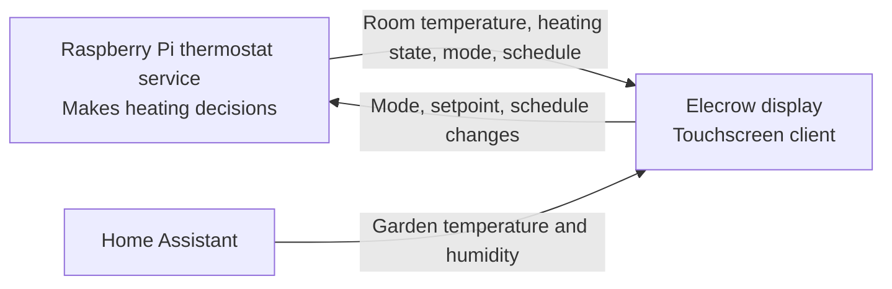
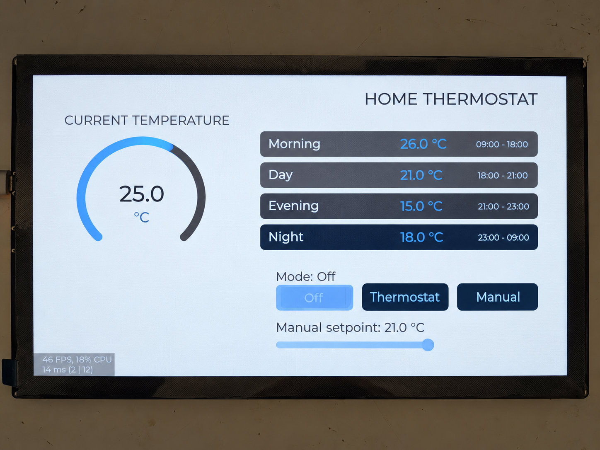
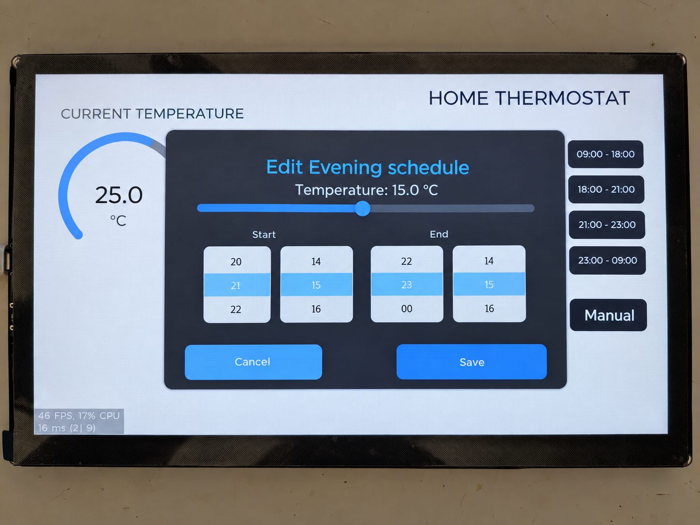
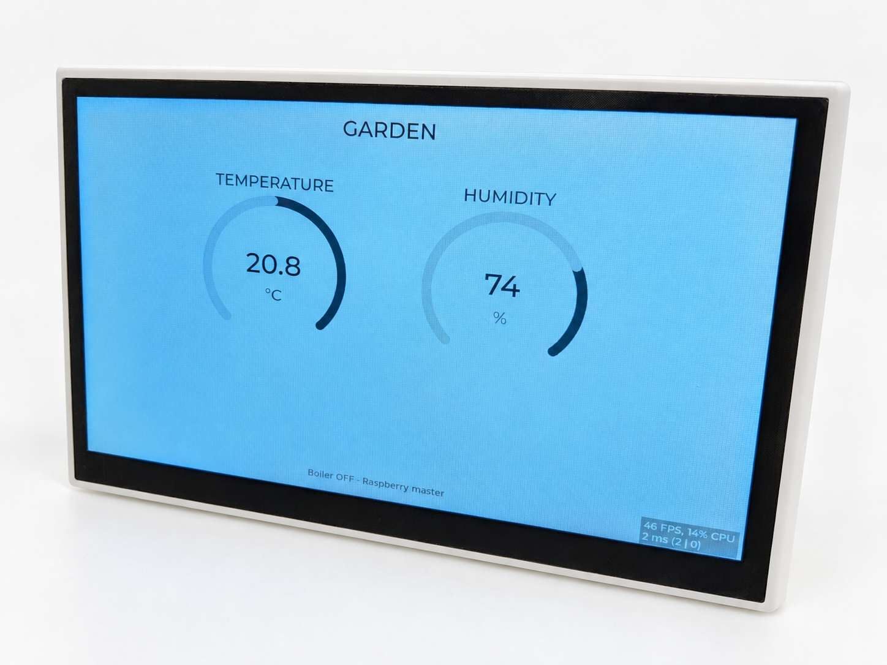
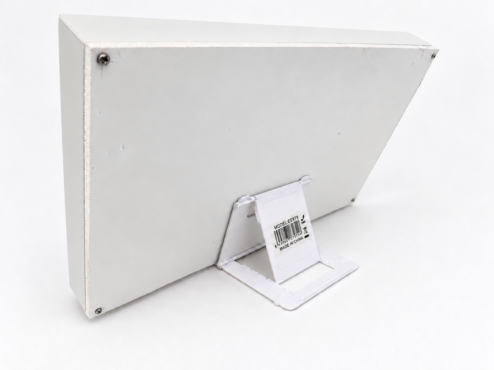
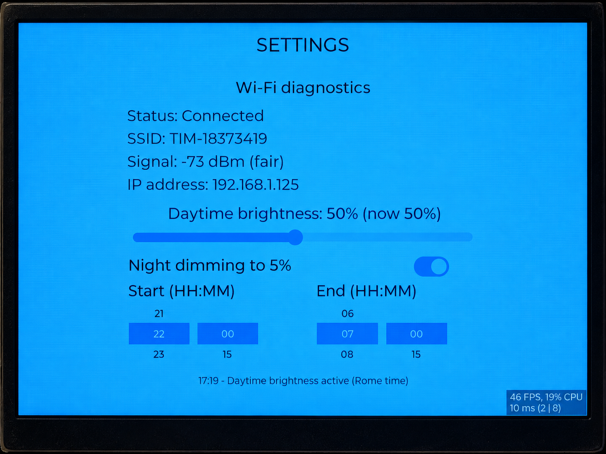

# Elecrow Display — Thermostat Dashboard

Touchscreen thermostat dashboard for the Elecrow CrowPanel Advance-P4 (1024 × 600), built with Arduino, PlatformIO, and LVGL 9.1.0.

The display acts as a client for a Raspberry Pi thermostat service and Home Assistant. The Raspberry Pi provides the room temperature, heating state, operating mode, and schedule; Home Assistant provides the garden temperature and humidity. Heating decisions belong to the thermostat service.



## Features

- Room temperature, garden temperature, and humidity gauges.
- Animated flame when the thermostat reports active heating.
- **Off**, **Thermostat**, and **Manual** operating modes.
- Manual temperature adjustment from 10 to 30 °C.
- Four editable schedule periods: Morning, Day, Evening, and Night.
- Schedule start/end times selectable in 15-minute steps.
- Wi-Fi diagnostics showing connection state, SSID, signal strength, and IP address.
- Screen brightness adjustable from 5 to 100%, retained across restarts.
- Automatic Wi-Fi reconnection and ESP32-C6 recovery after repeated complete request failures.

Sensor polling runs in a background FreeRTOS task, with a five-second delay between polling cycles. The actual interval also includes network request time.

## GUI gallery

Photos of the dashboard running on the CrowPanel. Readings and schedules shown are examples from the running installation.

### Home thermostat

Room temperature, four schedule periods, operating mode buttons, and the manual setpoint slider.



### Schedule editor

Editing the Evening period's temperature and start/end times, with Save and Cancel controls.



### Garden

Temperature and humidity readings from Home Assistant, with the thermostat's boiler status below.



Rear view of the display enclosure and its stand.



### Settings

Wi-Fi connection diagnostics and the screen brightness slider.



## Hardware and software

- Elecrow CrowPanel Advance-P4 with ESP32-P4 and onboard ESP32-C6 Wi-Fi coprocessor.
- EK79007 display controller over MIPI-DSI and GT911 touch controller.
- USB connection for firmware upload and serial diagnostics.
- PlatformIO CLI, or VS Code with the PlatformIO IDE extension.
- A reachable thermostat HTTP service and Home Assistant instance.

`platformio.ini` selects the `crowpanel_p4` environment, the Arduino framework, and pioarduino platform release `55.03.311`. It uses the custom `elecrow_p4` board variant and `huge_app.csv` partition layout, providing a single 3 MB application slot without OTA slots.

The display libraries are bundled in `lib/`: `ESP32_Display_Panel`, `ESP32_IO_Expander`, `esp-lib-utils`, and LVGL. PlatformIO downloads ArduinoJson through `lib_deps`. Keep the bundled libraries and project configuration together when copying or cloning this project.

## Configuration

### Wi-Fi and Home Assistant

Create `include/secrets.h` with the following definitions, replacing the example values:

```cpp
#pragma once

#define WIFI_SSID "your-wifi-name"
#define WIFI_PASSWORD "your-wifi-password"

#define HA_BASE_URL "http://homeassistant.local:8123"
#define HA_TOKEN "your-home-assistant-long-lived-access-token"
#define HA_GARDEN_TEMPERATURE_ENTITY "sensor.garden_temperature"
#define HA_HUMIDITY_ENTITY "sensor.room_humidity"
```

Use a Home Assistant long-lived access token and entity IDs that exist in your installation. The sensor states must contain numeric temperature and humidity values. Set the base URL without a trailing slash.

`include/secrets.h` is already excluded by `.gitignore`. Keep real credentials out of committed files.

### Thermostat service

Set `THERMOSTAT_BASE_URL` near the top of `src/main.cpp` to the address of your thermostat service. The current configuration uses a local HTTP service on port 2048. Set the URL without a trailing slash.

The service must implement the API described below. Its server implementation is not included in this project.

### Serial port

`platformio.ini` currently selects a Linux `/dev/serial/by-id/` device for `upload_port`; `monitor_port` uses the same value. Change it to match your board, or remove both settings to let PlatformIO select a port.

Upload speed is 921600 baud. Serial monitoring uses 115200 baud.

## Build and upload

From the project directory, with PlatformIO available in your terminal:

```sh
pio run -e crowpanel_p4
pio run -e crowpanel_p4 -t upload
pio device monitor -b 115200
```

In VS Code, open this directory as a PlatformIO project and use **Build**, **Upload**, and **Serial Monitor** from the PlatformIO toolbar. The first build needs internet access to download the platform, toolchain, and managed dependencies.

## Using the dashboard

Swipe horizontally between **Garden**, **Home Thermostat**, and **Settings**. The Garden page shows the Home Assistant readings; the Home Thermostat page shows the room temperature and heating controls.

On the thermostat page, select an operating mode or adjust the manual setpoint. The manual setpoint is sent when you release the slider. Mode changes are confirmed by the next successful state poll from the Raspberry Pi.

Tap a schedule row to edit its temperature and start/end times, then choose **Save**. Each period ends when the next period starts; the Night period wraps back to Morning. Saving therefore sends two requests: one for the selected period and one to update the next period's start time. These requests are separate, so a failure can leave only one update applied. Subsequent polling displays the server's authoritative state.

Use the settings page to inspect Wi-Fi diagnostics and adjust brightness. Brightness is saved locally using Arduino Preferences.

## Thermostat API

Requests use JSON over HTTP. The client does not send an authentication header to the thermostat service.

| Method | Endpoint | Request / purpose |
| --- | --- | --- |
| GET | `/api/state` | Read temperature, mode, setpoint, heating state, and four schedule entries. |
| POST | `/api/mode` | `{"mode":"Thermostat"}`; accepted UI values are `Off`, `Thermostat`, and `Manual`. |
| POST | `/api/manual_temp` | `{"temp":21}` |
| POST | `/api/schedule` | `{"index":0,"start":"06:30","temp":21.0}`; indexes are 0–3. |

Example response for `GET /api/state`:

```json
{
  "mode": "Thermostat",
  "room_temp": 20.5,
  "setpoint": 21.0,
  "heating": true,
  "schedule": [
    {"start": "06:30", "temp": 21.0},
    {"start": "08:30", "temp": 19.0},
    {"start": "18:30", "temp": 21.0},
    {"start": "20:30", "temp": 17.0}
  ]
}
```

The state response must have exactly four schedule entries. GET requests require HTTP 200; thermostat POST requests are considered successful for any HTTP 2xx response.

Home Assistant readings use `GET /api/states/<entity_id>` with a Bearer token. The current parser expects the compact JSON form `"state":"value"`; changes to response formatting may require updating `read_home_assistant_state()`.

## Project layout

| Path | Contents |
| --- | --- |
| `platformio.ini` | Build environment, dependencies, partition selection, and serial ports. |
| `src/main.cpp` | Dashboard, network requests, thermostat controls, and initialization. |
| `src/ani_flame.h` | Embedded animated flame asset. |
| `src/lvgl_port.*` | LVGL display/touch integration and task locking. |
| `src/*conf.h`, `src/board_config.h` | Display, touch, LVGL, and board configuration. |
| `include/secrets.h` | Local Wi-Fi and Home Assistant credentials; ignored by Git. |
| `variants/elecrow_p4/` | Custom Arduino pin definitions and ESP-Hosted SDIO configuration. |
| `lib/` | Bundled libraries. |
| `reference/elecrow/` | Vendor example, provenance, and recorded vendor changes. |
| `.pio/` | Generated PlatformIO build files and downloaded dependencies. |

## Troubleshooting

- **Missing `secrets.h`:** create `include/secrets.h` with all definitions shown above.
- **Upload fails:** check the selected serial port, USB connection, and device permissions. Close other applications using the port.
- **Display or touch does not initialize:** inspect the serial log for LDO, panel, or touch errors. This configuration targets the Advance-P4 hardware; other panels may need different settings.
- **Wi-Fi reconnects repeatedly:** check the credentials and the signal shown on the settings page. The firmware resets the C6 when recovering a previously established connection, and after three polling cycles in which all three service requests fail.
- **Thermostat request fails:** check `THERMOSTAT_BASE_URL`, service availability, and the response schema. Serial logs include thermostat POST results and JSON parsing errors.
- **Home Assistant gauges do not update:** check the URL, token, entity IDs, numeric sensor states, and response formatting. Failed readings leave the previous displayed values in place.

## Git and attribution

Before the initial commit, add `.pio/` to `.gitignore` to exclude generated build artifacts. Keep `src/`, `variants/`, `platformio.ini`, and the bundled libraries under version control so the project can be rebuilt.

This project adapts Elecrow's `Lesson09-LVGL_Lighting_Control` example. See `reference/elecrow/upstream.txt` for the recorded source and `reference/elecrow/` for the reference files. Bundled dependencies retain their own license files; consult those files before redistributing them.
